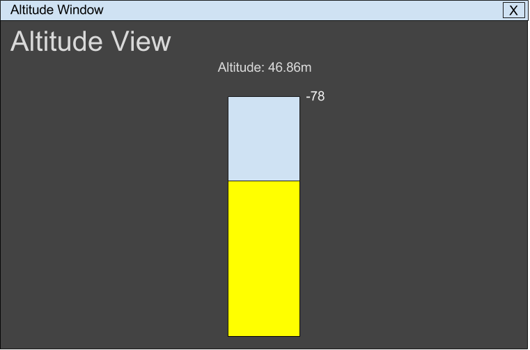

# WARG Groundstation Bootcamp

## Introduction

WARG members often find that joining this team requires more knowledge and has a larger learning curve than other student teams. Once members have acquired this knowledge they gain a lot of confidence and are able to make large contributions to the team. Therefore, this Bootcamp is designed as a first task to be completed to both help you through the learning curve, while giving you a project that is fully your own. The hope is that once you complete this Bootcamp you will feel confident and hopefully have acquired enough skills such that you are ready to take on tasks with our aircraft! Just a quick disclaimer, this Bootcamp will help accelerate and minimize the learning curve but it will not give you all knowledge. The remaining knowledge will be acquired through completing other tasks with the team.

## Bootcamp Objectives

- Become familiar with the Groundstation's underlying architecture
- Learn Javascript, Node.js,and NW.js
- Gain a general understanding of web development

## Bootcamp Outline
This Bootcamp has two options, both of which require a team lead's approval of completion in order to move onto working on other tasks. The estimated time of completion for this Bootcamp is 1 week.

## 1. Add an altitude dial to the groundstation:

### Background

The groundstation receives telemetry data from the plane in real time. To do this, is creates a socket connection to the data relay
station, and listens to any data it sends. The point of the groundstation is to allow the ground control team to view the aircraft's
current position and orientation in real time, all the time. Raw data is hard to follow and track, and some forms of data are better
represented visually.

### Task

You are tasked creating an altitude dial for the groundstation. This will involve adding a menu item to the application, which in turn
will open up a window that displays 2 things:

1. The text value of the altitude in meters (ie. 85.63m)
2. A rectangular dial that changes its height based on the altitude of the aircraft

### Requirements
- The rectangular dial's maximum height will correspond to the maximum height of the aircraft during the flight
- The rectangular dial's color will change from red, to yellow, to green. These will be at 33% intervals of the maximum height. 
So if for example, throughout the flight, the maximum height of the aircraft was 100m, then if the current height of the aircraft
is less than 33m, the dial would be red. If its less than 66m it would be yellow, and if its greater it would be green.
- A maximum of 2 decimal places should be shown in the text of the altitude

### Checklist
- There is new menu item under the ground station's Window menu
- The menu item opens up a new window, that uses a custom view to display the aircraft's altitude
- There is a sensible amount of comments in the code
- Any custom functions and modules were documented using JSDOC syntax. Read [here](../groundstation/documenting.md) for more info.

*Note: It is **HIGHLY** reccommended that you read the [groundstation tutorial](../groundstation/tutorial.md)*.

### Hints
- The `TelemetryData` module is the module responsible for sending out telemetry data about the plane
- The datalink documentation (the data the groundstation received) can be found [here](../picpilot/datalink.md)
- The `AltitudeView.js` file is the view responbile for displaying the circular altitude dial in the groundstation. Its a very good
reference
- The groundstation does nothing until it starts receiving data. To have it receive data, open up the Simulation window and start a simulation
- When you an element under the `ui` property of the view, `this.ui.element_name` is a jquery wrapper for that element, 
so you can use jquery methods on it to manipulate it (say for example changing its color or height)
- Additional resources on the groundstation, including its documentation can be found [here](../groundstation/resources.md)

**NOTE:** Don't worry if you're unfamiliar with javascript or if these hints made no sense to you. If you read the [groundstation documentation](../groundstation/index.md) and just dive right in, you'll get the hang of it eventually.

### Git
We suggest making a seperate branch on git to do your bootcamp. Making a pull request is not necessary after the completion of your bootcamp, simply show your work the responsible team lead.

### Example: 

## 2. Previous Team Contribution

If you have worked on the Groundstation before, and feel that you've made a significant enough contribution to be exempt from option 1, you can contact the responsible team lead to explain, and preferably show what you've done. It will be up to the Team Lead’s discretion whether you qualify to be exempt from the Bootcamp. If the Team Lead feels that you should still complete option 1 it is because they think you can learn and gain skills from the completion of the Bootcamp.

## Completion of Bootcamp

Upon the approved completion of the Bootcamp by a Team Lead you are now eligible to work on other tasks related to the groundstation. If you have any feedback you would like to give to make this Bootcamp better please let a team lead know as we want this to be the best and most informative introduction to the team as possible.

