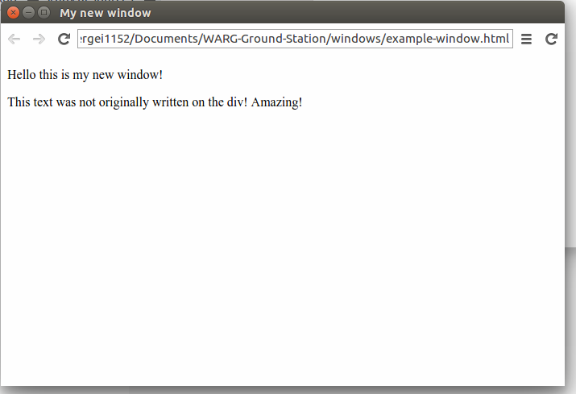
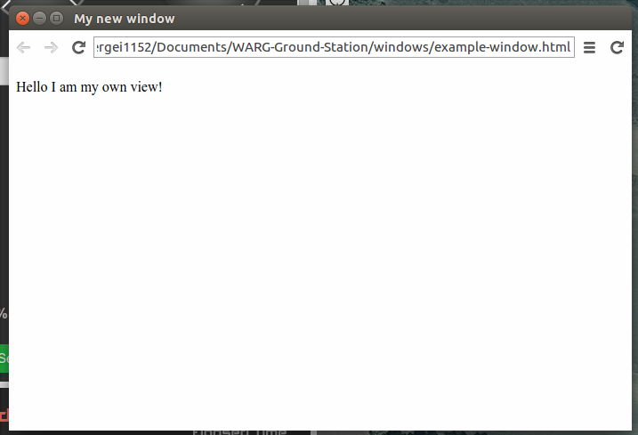
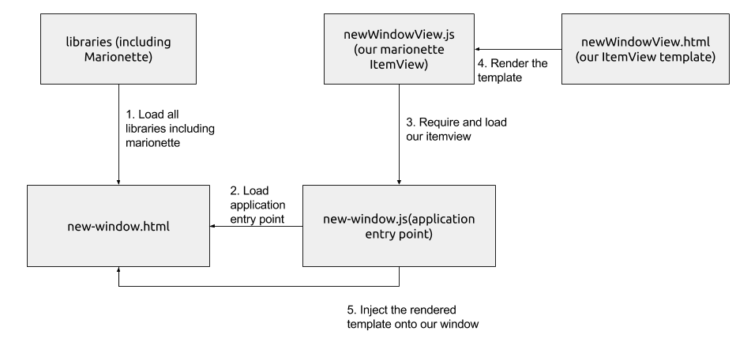

# Groundstation Tutorial

This tutorial will guide you through creating a groundstation window and adding logic to it using the core application modules. 

## Installation

Follow the installation guide [here](installation.md) to install the groundstation on your computer.

## Editor

You can use your prefered editor for this application, or an IDE like Webstorm if you prefer.

## Getting Started

Take a look at the [project structure](project-structure.md) so you roughly know what each folder of the application is for.

## Creating a new window

To start create a window, we need to create an html file that will represent our window. In the `window` folder at the project root, create a file and call it `new-window.html`. Paste this boilerplate code on there:

```html
<!DOCTYPE html>
<html lang="en">
<head>
    <meta charset="UTF-8">
    <title>My new window</title>
</head>
<body>
    <p>Hello this is my new window!</p>
</body>
</html>
```

## Adding a menu item

So all we've done is create a layout file for the new window. Now we've got to 
have a way of opening the window. To do this we'll add a menu item to our application which will open up our window. 

Open up `app/Menu.js`. This is the file the application uses to configure it's menu items. At the bottom of the file, add this entry under the window submenu:

```javascript
// ===Window Submenu ===
    var window_submenu=new gui.Menu();

    //A bunch of code here

    //You need to add this
  window_submenu.append(new gui.MenuItem({
    label:'My new window',
    type:'checkbox',
    click: function(){
      gui.Window.open('windows/new-window.html',{
        focus: true
      });
    },
    key: "k",
    modifiers: "ctrl-shift",
  }));


```

Now lets see what we just did. Calling `window_submenu.append(..)` appends a menu item to the Window menu of the app. In this case its a `gui.MenuItem` which represents a menu item in NW.js applications. The `label` parameter is the name of the menu item, the `type: checkbox`  indicates that we want the menu item to behave as a checkbox (when you open the window its checked). The `click` parameter indicates the callback funtion to execute when the user has clicked on the menu item. Here, we are calling `gui.Window.open(...)` to open up the window layout file we've just created. The `key` and `modifiers` parameters indicate the keyboard shortcuts that may be used to open up the window as well.

Now run the app. In the window submenu you should see a new item called "My new window". When you click it a new window will appear, with the text 'Hello this is my new window!'. 

Awesome, you've just added a window to the app. Now lets add more functionality to it with javascript.

## Adding javascript functionality

Every window you add will require a starting point. A single entry-point module. For the main application it is `app/App.js`. For your window it'll be different. You will have to create that entry-point module and load it in the window layout file you just created. This module will then load all of its dependencies (if any) and handle creating the view. 

To begin create a file called `new-window.js` inside the `app/windows/` folder. Then in `new-window.html` file you created earlier, paste this after the `<title>` tag.

```html
<!-- Our libraries -->
<script src="../app/lib/jquery-2.1.4.js"></script>
<script src="../app/lib/underscore.js"></script>
<script src="../app/lib/backbone.js"></script>
<script src="../app/lib/backbone.marionette.js"></script>

<!-- Our window entry point -->
<script src="../app/windows/new-window.js"></script>
```

So what are all of these scripts? They are libraries that you will end up using later in the tutorial. The main one we'll use is Marionette, and the rest are dependencies that Marionette requires, such as underscore and jquery.

Now lets create an element that we can play around with in our script. Under the `<p>` tag add of the `new-window.html` file add this line:

```html
<div id="special">Our Special div</div>
```

We've assigned an id to this div so that we can reference it later in our javascript. 

Now that we've got our layout file ready, lets add the functionality in our application entry point. In `new-window.js`, add this line:

```javascript
$(document).ready(function(){
  $('#special').text('This text was not originally written on the div! Amazing!');
});
```

Now lets go to our app and open up the window. You should see this: 



If all went well, you have successfully created an application entry point script for your newly created window. You are now ready to add more complex functionality to it. The next section will talk about debugging your application and implementing Marionette and MVC in your window.

## Debugging

If your window still says 'Our Special div' that means you've made a mistake. To diagnose what went wrong, you can open up the developer tools console by clicking on the three bars right next to the url bar of the window. It'll tell you if there were any javascript errors or if any files failed to load.

## Creating the Marionette ItemView

So what we did previously is use jquery directly to manipulate a div in our layout (the view). That was a pretty simple example, however continuing to work on it this way will lead to hard to maintain code, since we're mixing our view logic (ie manipulations) and our application logic together. This is something we should avoid doing, and with the help of Marionette, its pretty easy to do so. 

To get started, create a new file called `newWindowView.js` in the `app/views/` folder. Copy and paste this boilerplate code:

```javascript
//This is an example Marionette view
//NOTE: you should not require jquery in your views, as you should only reference the elements inside the view which you can do with the ui property of the view
var Template=require('../util/Template');
/*
call your other dependencies here (for example if you need to listen to network events, call this)
var Network=require('../Network'); 
then use the Network object inside your view
*/

module.exports=function(Marionette){

  return Marionette.ItemView.extend({
    template:Template('newWindowView'), //name of the file in the views folder at the project root
    className:'newWindowView', //this is the class name the injected div will have (refer to this class in your style sheets)

    ui:{ //any ui elements in the view that you would like to reference within your view logic
      an_element:"#an-example-element" //you can now refer to the jquery wrapped element within the view with this.ui.an_element
    },

    //your custom jquery events
    //selector then the name of the callback function
    events:{
      "click #an-example-element": "clickCallback"
    },

    initialize: function(){
      //called when the view is first initialized (ie new ExampleView())
    },
    onRender:function(){
      //called right after a render is called on the view (view.render())
    },
    onBeforeDestroy:function(){
      //called just before destroy is called on the view
    },
    onDestroy:function(){
      //called right after a destroy is called on the view
    },

    clickCallback:function(event){ //will be fired when a user clicks on #an-example-element

    }
  });
};
```

Then, in your `new-window.html` file, delete the `<p>` and `<div>` lines, so that there is nothing in the `<body>` tag.

Now create a new layout file for the view by creating a file called `newWindowView.html` inside the `views/` folder at the project root. Paste this in the file:

```html
<p>Hello I am my own view!</p>
```

And in your `new-window.js` file replace all of the code with this:

```javascript
//our new-window.js file (the window entry point)
var windowView=require('./app/views/newWindowView')(Marionette);

$(document).ready(function(){
  $('body').append((new windowView()).render().$el);
});
```

Now open up the groundstation and open up your window again. You should now see this:



## Explaning Marionette and ItemViews

So lets do a breakdown of what we just did. 

Lets start of by explaning what an ItemView is. A Marionette itemView represents..a view. The itemView manages all aspects of the view, including rendering, capturing user input, etc.. 

Each ItemView has to have its own template file, which is the `newWindowView.html` file we created in the `views/` folder. We specify this in our ItemView by setting the `template` property. The ItemView will render that template and then our application entry point (`example-window.js`) will append it to the body of our window. Here is a diagram showing what happens:



## Why do it this way?

You may be asking yourself what was the point of doing all the fancy stuff if the end result was the same. What we've just done is seperated our view logic and application logic into different modules. Now, say we want to create a combined window that combines our view with the map. Because all of the logic associated
with our view is completely isolated, there is no code that we have re-write. We simply import the views that we're interested in and inject them into our new window. This form of writing applications is called an [MVC](http://www.tomdalling.com/blog/software-design/model-view-controller-explained/) pattern, standing for Model View Controller.