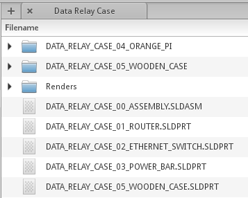
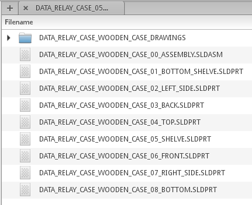

# WARG CAD Guidelines
To keep things more consistent at WARG, we enforce a set of guidelines on all submitted CAD designs. This only applies to mechanical CAD files (not electrical). Since we use Solidworks for most of our mechanical work, these guidelines mainly apply to it. 

## The 13 CAD Commandments
In order for your design to be accepted it must adhere to all the commandments listed below. If the part does not you will be notified what modifications need to be made in order for it to be accepted. Once your part is accepted you can begin to manufacturer/make the part. If an assembly of parts is being made all parts and the assembly must be approved before manufacturing/making the assembly.

1. All parts (sketches) must be fully defined
2. All fastening holes (screw, bolt etc.. holes) must be done using hole wizard
3. Use relations to eliminate redundant dimensions
4. Parts must be made in MMGS scale
5. Parts must use [WARG’s standard naming convention](#cad-naming-convention)
6. Assemblies must contain ALL components fully defined and related such that distances are equal
7. Assemblies must have ALL holes concentric with fasteners of required length mated to the holes (check McMaster Carr if you need CAD models of fasteners)
8. NO assembly features
9. When making part revisions look at the previous version and identify any filing/drilling/sanding/machining you had to do to the parts to make them fit and ENSURE that the new part is modified so that the changes don’t have to be made again.
10. Fillets/Chamfers of equal size must be made in the SAME feature. All fillets/chamfers must be added as features and NOT included in the sketches.
11. Ensure that your assemblies are manufacturable with appropriate tolerances (ie parts have clearance to be assembled and parts don’t have to go through walls/break physics to work).
12. Consider the thickness and dimensions of parts to ensure that they are reasonable. A 3mm and 5mm thickness go a long way.
13. All of the relevant CAD files should be uploaded and synced on [GrabCad](https://grabcad.com/). The design will **NOT BE REVIEWED** if it is not on GrabCad. Screenshots and stl files do not suffice.

**NOTE**: *If you violate one of these commandments you must notify a team lead with a valid explanation as to the reason for violating the commandment*

## CAD Naming Convention
All CAD files should adhere to the following naming convention (snake upper case):

### For regular part files
```
<PROJECT_NAME>__<SUBASSEMBLY_NAME>_<PART##>_<PART_NAME>.SLDPRT
```
eg. `SPIKE__GIMBAL_03_OUTSIDE_CASE.SLDPRT`

### For assemblies
```
<PROJECT_NAME>__<SUBASSEMBLY_NAME>_00_ASSEMBLY.SLDASM
```
eg. `SPIKE__GIMBAL_00_ASSEMBLY.SLDASM`

### For assemblies within assemblies
Create a folder with the same naming convention as the part, and follow the same naming convention inside the folder, prepending the project name.

For example, if the gimbal assembly contains a part camera which itself is also an assembly:

1. Create folder named `GIMBAL_02_CAMERA`
2. Inside the folder follow the same naming convention, but prepend the original project name at the begining.

eg.
```
GIMBAL_00_ASSEMBLY.SLDASM
GIMBAL_O1_CAMERA
 --> GIMBAL_CAMERA_00_ASSEMBLY.SLDASM
 --> GIMBAL_CAMERA_01_GO_PRO.SLDPRT
```
### For drawings
In the assembly folder create another folder to store drawings.
```
<PROJECT_NAME>_DRAWINGS
```
For the actual part files, follow the same naming convention as above, and store them in this folder.

### Renders
Create a seperate `Renders` folder within your project and dump all your renders there. No naming convention here

### Example
Project Name: DATA_RELAY_CASE

Sub Assemblies: Wooden Case, OrangePi

#### Project Root


#### Sub-assembly
