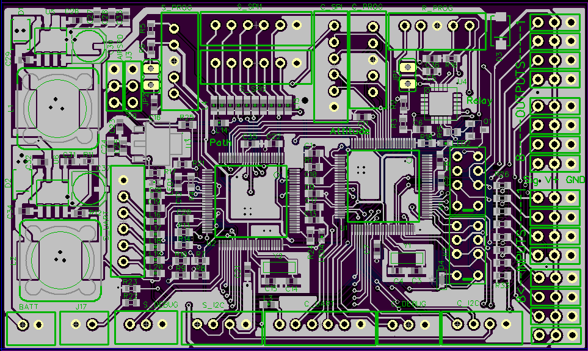
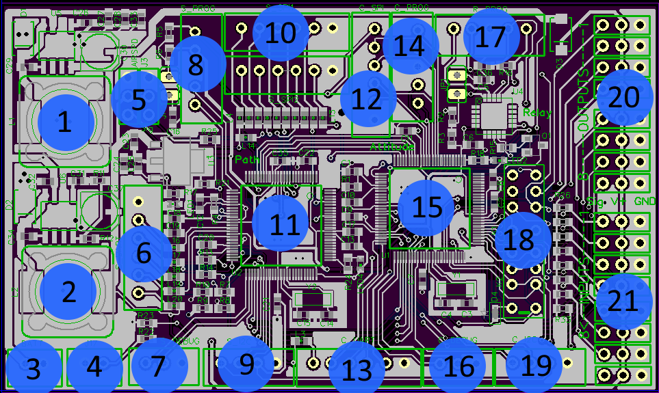

# Introduction

The PICpilot is a software package meant to control fixed-wing aircraft and numerous "copters", among other vehicles. It requires the usage of a specific type of digital signal microcontroller. This microcontroller is produced by [Microchip](http://www.microchip.com). The microcontroller that is currently supported is the [dspic33fj256gp710A](http://www.microchip.com/wwwproducts/Devices.aspx?product=dsPIC33FJ256GP710A). However, many other similar models can be easily adapted for support.

This software is designed to be used with two communicating microcontrollers (essential double cores). Due to the atypical nature of the software, it is recommended to view the board schematics [here](https://drive.google.com/file/d/0BySpWXvmBM4JTTBIQmR0bXVOd1k/edit?usp=sharing). The schematics are also included in another section of this document.

The two processors are allocated to two individual tasks. The chip which is responsible for attitude management is often referred to as the "main" chip. It is responsible for making corrections to the planes orientation in space, which involves pitch, roll, yaw, heading, throttle, and altitude. It also manages a few additional tasks involving relaying communication with the ground station. The second processor is often referred to as the "Path Manager". This chip controls the where the plane should fly (path), and the transitions in altitude and heading between each waypoint (specific GPS coordinates). It also controls the GPS and altitude sensors. These two chips work asynchronously from one another in order to automate the plane.

## Setup

To get started, you will need three things:
* A Git Client - https://github.com/
* MPLAB XC16 Compiler (16-bit) - http://www.microchip.com/pagehandler/en-us/family/mplabx/home.html?tab=t2#tab-2
* (Optional) MPLAB X IDE - http://www.microchip.com/pagehandler/en-us/family/mplabx/home.html?tab=t2#tab-2

## Github Setup

A similar powerpoint presentation can be found here:[https://docs.google.com/presentation/d/1HkjCdRQyY1LFaUO-24SxHGLx4cgeq_Z5OWQQNKFfidM/edit?usp=sharing](https://docs.google.com/presentation/d/1HkjCdRQyY1LFaUO-24SxHGLx4cgeq_Z5OWQQNKFfidM/edit?usp=sharing)

If you are not using the GUI skip this section.

1. Setup a [Github](https://github.com) Account
2. Select "Set up Git"
3. Select "Download GitHub for <Your Operating System>"
4. Select "Run" and continue through the installation process
5. Once the installation is complete, launch the application.
6. Log in
7. Find the Git Bash shell and type in the following commands:  
`git config global user.name "YOUR USERNAME HERE"`  
`git config global user.email "YOUR EMAIL HERE"`  
These set the default name and email you use when committing to GitHub.
8. At this point you will need to let one of the WARG team leads know your username, so that you can be added to the repository member's list.
9. You should then be able to clone the project using the clone button, or the project URL.  
  
You should now have the code. 

## MPLAB Setup

You now need the libraries and compilers, as well as the optional MPLAB X IDE, in order to develop code.

### Compiler

1. Download the [compiler](http://www.microchip.com/pagehandler/en-us/family/mplabx/home.html?tab=t2#tab-2). You want the MPLAB XC16 Compiler V1.21 or newer. Unzip the file once it is completed.
2. Accept the license agreement.
3. Select "Install Compiler".
4. Select "Install MPLAB XC16 C Compiler on this computer.
5. Leave the activation key blank. Confirm "Yes" when the dialog prompts you about using the free version.
6. Select "Run the compiler in free mode".
7. Select the installation directory.
8. Run and finish the installation.

* Note whenever you make a new project, make sure the right compiler is selected, otherwise there will be a lot of indicated syntax errors (red underlines).

### IDE (The fancy word editor that lets you do some code-shenanigans)
1. Download the [IDE Package](http://www.microchip.com/pagehandler/en-us/family/mplabx/home.html?tab=t2#tab-2). You want the MPLAB X IDE V2.10 or newer. Unzip the file once it is completed.
2. Proceed through the installation process (select installation directory, accept license agreement).

## GitHub Usage

If you don't know how to use Git or you need a reference, [GitImmersion](http://gitimmersion.com/) is a great website.

####GUI Usage:
* Make sure you have correctly set your default storage location in the Options menu.  
  
**Saving Files (Committing and Pushing)**  
  
1. Select your Project
2. Select the files that are supposed to be committed.
3. Write a commit message, that gives a general overview about each change completed in this update.
4. Hit "Commit".
5. Once you are ready to sync the changes, hit the sync button (top of the window).

**Reading Files from the Server (Pulling)**
* Simply click the sync button at top of the window.

####General Syntax (Git Bash):
* `git add <Filename> or git add .` stages the file for commit.
* `git status` displays all changes being made.
* `git commit -m "<Commit message here>"` makes the change.
* `git push` sends the change to the server
* `git pull` retrieves the latest change from the server.
* `git checkout <HASH>` retrieves a SPECIFIC version from the server.
* `git checkout -b <Branch Name>` creates a new branch.
* `git merge master` merges the current branch with the latest code.

####General Concepts:
* When making small changes it is okay to commit to the master branch.
* When making large changes (that take multiple days to complete), always make a branch, so that others can work concurrently without compiling broken code.
* Always build your code before committing (To make sure it isn't broken).
* Try and get rid of warnings if possible.

##C (Programming Language)

The language being used in this project is C. If you are familiar with C++, the concepts are very similar. C is a low level programming language. This means that it does not have a large amount of "built-in" functionality, therefore learning C is quite straight forward.

The compiler used for this project is listed above. It is a modified version of the GCC Compiler.

A set of well maintained tutorials can be found here: [http://www.cprogramming.com/tutorial/c/lesson1.html](http://www.cprogramming.com/tutorial/c/lesson1.html)

Topics that one should be familiar with include (in order of importance):

- If statements
- Looping
- Functions
- Variable types and how they work
- Arrays
- Pointers
- Structures, Unions

Unrelated topics:

- Printf (There is no GUI)
- File I/O (All I/O operations are specific to the chip)

Knowledge of common data structures (binary trees, linked lists, etc.) is beneficial, but not mandatory.

## Programming the Device

In order to program the device, you must have setup your account according to the Setup section. You should also refer to the Schematics and Board Design section for the ports required to complete the programming process. You will require an ICD 3 or a similar programming device.

When using the MPLAB X GUI the process to program the device is as follows:

-
  1. Ensure the project you wish to program is the main project.
  2. Connect a cable to the programming port. The pins that should be part of the programming port are MCLR, PGD1, and PGC1.
  3. Click the "Make and Program Device" button in the top toolbar. Optionally, you can also press the debug button to use the debugging features of MPLAB X.

When using your own editor and compiling from the command line:

-
  1. Have the binary file ready for programming.
  2. Connect a cable to the programming port. The pins that should be part of the programming port are MCLR, PGD1, and PGC1.
  3. Open the MPLAB IPE interface.
  4. Select your chip model.
  5. For the source option, browse to your binary file.
  6. Press program and wait. Then optionally also use the verify option (recommended).

If you are using both chips of the PICpilot, ensure you correctly set the chip identifier pre-compiler in the main.h file, and ensure you program both chips.

##Autopilot System Overview

The autopilot system is meant to be adaptable to any aircraft including fixed-wing and multi-rotor aircraft (still WIP). This document mostly covers the software design of the system, although there are a few hardware notes made in this section and the next.

First of all, the flowchart block diagram of the system is presented below:

From this diagram you can see how the software combined with the hardware interacts to provide the final resulting UAV behaviour.

There are three chips. The main one is most commonly referred to as the attitude manager. It is also the communication manager, and the Master chip for all interchip communication. The other chip is referred to as the path manager. The third one has the dedicated task of managing the mechanical "safety" relays which ensure that a safety pilot can always regain control of the aircraft.

There are four sensors used in the original design of the aircraft. A GPS (Global Positioning System), IMU (Inertial Measurement Unit), Altimeter, and a camera are all part of the system. Additionally, 2 wireless interfaces are included in the design. A wireless Xbee transmitter/receiver provides telemetry data, whereas an additional (Ultra-high frequency [UHF]) receiver is used to attain control from a standard RC controller.

The outputs from the system include pictures and potentially video, telemetry data, and a functioning aircraft (with moving flaps, elevators, rudder, and ailerons).

This document only covers the PICpilot, however a system overview of a previously fully assembled system will be described in this section. In the past, the PICpilot has been expanded into a larger and more sophisticated system as seen below.

## Schematics and Board Design

The following schematic is V2.1 of the PicPilot. You can check out the board schematics [on GrabCAD](https://workbench.grabcad.com/workbench/projects/gcMS11AcdVnQvS14KhtlL2Ihf33rdxOGKYGdbkc53rDmB_#/folder/1932453). You will require [Diptrace](http://diptrace.com/download-diptrace/) in order to view the files. You can use the free version or use WARG's "Pro" license.

This board has 2 dspic33fj256710a chips. This is the PCB for the board. This is the labelled version:

1. Switching Power Supply 1

2. Switching Power Supply 2

3. Battery Port

4. External Battery Monitor

5. Analog sensors: airspeed and ultrasonic

6. UART2 Port -“ Unused

7. Path Manager Debug

8. Path Manager Programming Port

9. I2C- Altimeter

10. SPI Ports: Top- GPS, Bottom- Unused

11. Microcontroller 2 -“ Path Manager

12. SPI -IMU

13. UART2- Xbee

14. Attitude Manager Programming Port

15. Microcontroller 2 - Attitude Manager

16. Attitude Manager Debug

17. Relay Controller Programmer Port

18. Safety Relays (Inputs 1-4)

19. I2C - PWM Extension

20. PWM Outputs

21. PWM Inputs

To get a full list of the different pins, look at the schematic on GrabCad. Highlighted below are the ground connections (and you are politely reminded to NEVER connect these pins to anything but ground, always check before connecting cables).

## Project files

All the project files are hosted on Github. However, for convenience they are listed below (accurate at the time of writing of this document):

* AttitudeManager.c
* AttitudeManager.h
* cameraManager.c
* cameraManager.h
* Clock.c
* Clock.h
* commands.h
* debug.c
* debug.h
* delay.c
* delay.h
* fmath.c
* fmath.h
* FullInitialize.c
* FullInitialize.h
* I2C.c
* I2C.h
* InputCapture.c
* InputCapture.h
* InterchipDMA.c
* InterchipDMA.h
* lcd.h
* main.c
* main.h
* MPL3115A2.c
* MPL3115A2.h
* net.h
* net_common.c
* net_inbound.c
* net_outbound.c
* OrientationControl.c
* OrientationControl.h
* OutputCompare.c
* OutputCompare.h
* PathManager.h
* PathManager.c
* PWM.c
* PWM.h
* SPI.c
* StartupErrorCodes.c
* StartupErrorCodes.h
* StringUtils.c
* StringUtils.h
* UART1.c
* UART1.h
* UART2.c
* UART2.h
* VN_lib.c
* VN_lib.h
* VN_math.c
* VN_math.h
* VN_type.h
* VN_user.c
* VN_user.h
* VN100.c
* VN100.h
* voltageSensor.c
* voltageSensor.h

## Coding Convention

The coding convention form this project follows the standard coding convention for the C language.

The rule-set for the coding format is not extremely specific. However, there are a few rules of thumb to be aware of. The rules of thumb are:

1. [Naming convention](http://en.wikipedia.org/wiki/Naming_convention_(programming)) -“ Use [camelCase](http://en.wikipedia.org/wiki/CamelCase) notation for variables. Use capitals and _under\_score\_case_ for constants.
2. [Indentation Style](http://en.wikipedia.org/wiki/Indent_style) -“ Use tabs/indents to show the program structure.
3. Commenting -“ Be thorough with comments. Include a header at the beginning of every file describing the file, the author, the file name, and the date of creation. For headers, include comments describing any constants, and for each function prototype include the function name, function inputs and outputs, and a description of its functionality.
4. **Never hard-code values**. Any constants should be defined together so that they can be easily changed through iterations of the code.

